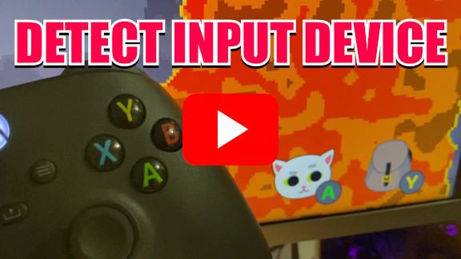

# Godot Input Helper

A simple input helper for the [Godot Engine](https://godotengine.org/).

Features:

- Detects what input device the player is using
- Can tell the difference between a few different gamepads
- Rumble a gamepad

## Installation

Copy the `addons/input_helper` directory into your `res://addons/input_helper` directory.

Enable `InputHelper` in project plugins.

## Documentation

- [Detecting devices](docs/Devices.md)
- [Rumbling](docs/Rumbling.md)

## Discord

## More information

  
_YouTube: Detecting input devices in Godot._

## Contributors

Godot Input Helper is made by [Nathan Hoad](https://nathanhoad.net) and [other cool people](https://github.com/nathanhoad/godot_input_helper/graphs/contributors).

## License

Licensed under the MIT license, see `LICENSE` for more information.