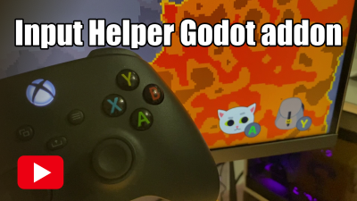

# Input Helper _for Godot 4_

A simple input helper for [Godot 4](https://godotengine.org/). _If you have Godot 3.x then you need [Input Helper v2.x](https://github.com/nathanhoad/godot_input_helper/tree/v2.x)._

You can [download a copy](https://github.com/nathanhoad/godot_input_helper/archive/refs/heads/main.zip) from GitHub.

 

## Features

- Detects what input device the player is using
- Can tell the difference between a few different joypads
- Get and set input action buttons and keys
- Rumble a joypad

## Documentation

- [Detecting Devices](docs/Devices.md)
- [Input Mapping](docs/Mapping.md)
- [Rumbling the joypad](docs/Rumbling.md)
- [C#](docs/CSharp.md)
- [Updating from Input Helper 3 to 4](3To4.md)

## Video overview

## Contributors

Godot Input Helper is made by [Nathan Hoad](https://nathanhoad.net) and [other cool people](https://github.com/nathanhoad/godot_input_helper/graphs/contributors).

## License

Licensed under the MIT license, see `LICENSE` for more information.
