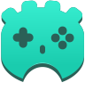

# Godot Input Helper

A simple input helper for the [Godot Engine](https://godotengine.org/).

Features:

- Detects what input device the player is using
- Can tell the difference between a few different gamepads

## Usage

Copy the `input_helper` directory into your `res://addons/` directory.

Enable `InputHelper` in project plugins.

Connect your input indicators to the `device_changed` signal to be notified when the player uses a new input device. For example:

```
func _ready() -> void:
    InputHelper.connect("device_changed", self, "_on_input_device_changed")


func _on_input_device_changed(device: String, device_index: int) -> void:
    print("XBox? ", device == InputHelper.DEVICE_XBOX_CONTROLLER)
    print("Device index? ", device_index) # Probably 0
```

## Contributors

[Nathan Hoad](https://nathanhoad.net)

## License

Licensed under the MIT license, see `LICENSE` for more information.